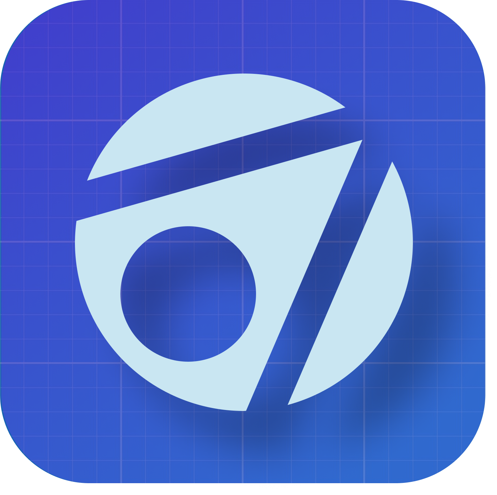

<!-- Improved compatibility of back to top link: See: https://github.com/othneildrew/Best-README-Template/pull/73 -->
<a name="readme-top"></a>
<!--
*** Thanks for checking out the Best-README-Template. If you have a suggestion
*** that would make this better, please fork the repo and create a pull request
*** or simply open an issue with the tag "enhancement".
*** Don't forget to give the project a star!
*** Thanks again! Now go create something AMAZING! :D
-->


<!-- PROJECT SHIELDS -->
<!--
*** I'm using markdown "reference style" links for readability.
*** Reference links are enclosed in brackets [ ] instead of parentheses ( ).
*** See the bottom of this document for the declaration of the reference variables
*** for contributors-url, forks-url, etc. This is an optional, concise syntax you may use.
*** https://www.markdownguide.org/basic-syntax/#reference-style-links
-->
[![Contributors][contributors-shield]][contributors-url]
[![Forks][forks-shield]][forks-url]
[![Stargazers][stars-shield]][stars-url]
[![Issues][issues-shield]][issues-url]
[![GPL-3.0 License][license-shield]][license-url]


<!-- PROJECT LOGO -->
<br />
<div align="center">
  <a href="https://github.com/xsafter/Theona">
    
  </a>

<h2 align="center">Theona</h2>
<h2 align="center">⚠️**Warning! This is development branch, all changes here are unstable.**</h2>

  <p align="center">
    Secure blockchain-based messenger with geolocation tracking
    <br />
    <a href="https://github.com/xsafter/Theona"><strong>Explore the docs »</strong></a>
    <br />
    <br />
    <a href="https://github.com/xsafter/Theona/releases">Download the app</a>
    ·
    <a href="https://github.com/xsafter/Theona/issues">Report Bug</a>
    ·
    <a href="https://github.com/xsafter/Theona/issues">Request Feature</a>
  </p>
</div>


<!-- TABLE OF CONTENTS -->
<details>
  <summary>Table of Contents</summary>
  <ol>
    <li>
      <a href="#about-the-project">About The Project</a>
      <ul>
        <li><a href="#built-with">Built With</a></li>
      </ul>
    </li>
    <li>
      <a href="#getting-started">Getting Started</a>
      <ul>
        <li><a href="#prerequisites">Prerequisites</a></li>
        <li><a href="#installation">Installation</a></li>
      </ul>
    </li>
    <li><a href="#usage">Usage</a></li>
    <li><a href="#roadmap">Roadmap</a></li>
    <li><a href="#contributing">Contributing</a></li>
    <li><a href="#license">License</a></li>
    <li><a href="#contact">Contact</a></li>
    <li><a href="#acknowledgments">Acknowledgments</a></li>
  </ol>
</details>


<!-- ABOUT THE PROJECT -->
## About The Project

![Theona screenshot][product-screenshot]

Theona is XMTP-based messenger for comfortable and secure messaging and tracking the location of your friends. 

<p align="right">(<a href="#readme-top">back to top</a>)</p>


### Built With

* [![Android][Android-badge]][Android-url]
* [![Kotlin][Kotlin-badge]][Kotlin-url]
* [![Jetpack Compose][JCompose-badge]][JCompose-url]
* [![Material You][Material-badge]][Material-url]
* [![Fastlane][Fastlane-badge]][Fastlane-url]
* [![Room DB][Room-badge]][Room-url]
* [![Hilt DI][Hilt-badge]][Hilt-url]
<p align="right">(<a href="#readme-top">back to top</a>)</p>


<!-- GETTING STARTED -->
## Getting Started

This is an example of how you can set up your project locally.
To get a local copy up and running follow these simple example steps.

### Installation

1. Get a free Mapbox API Key at [https://www.mapbox.com/](https://account.mapbox.com/access-tokens/)
2. Clone the repo
   ```sh
   git clone https://github.com/xsafter/Theona.git
   ```
3. Set your secret Mapbox key in your local `gradle.properties`(Linux/MacOS: `~/.gradle/gradle.properties`):
   ```properties
   MAPBOX_DOWNLOADS_TOKEN=YOUR_SECRET_MAPBOX_ACCESS_TOKEN
   ```
4. *Optional:* configure your [Sentry](https://sentry.io/) and add private token in `sentry.properties`

**Important**: If you don't want to use Sentry analytics, delete this lines in your `app/build.gradle.kts` 
```kts
plugins {
    //...
    id("io.sentry.android.gradle") version "3.12.0"
    //...
}
//...
sentry {
    includeSourceContext.set(true)
}
   ```
5. Build & run the app!
```sh 
./gradlew assembleDebug
```
<p align="right">(<a href="#readme-top">back to top</a>)</p>


<!-- USAGE EXAMPLES -->
<!--
## Usage

Use this space to show useful examples of how a project can be used. Additional screenshots, code examples and demos work well in this space. You may also link to more resources.

_For more examples, please refer to the [Documentation](https://example.com)_

<p align="right">(<a href="#readme-top">back to top</a>)</p>


<!- - ROADMAP -- >
## Roadmap

- [ ] Feature 1
- [ ] Feature 2
- [ ] Feature 3
    - [ ] Nested Feature

See the [open issues](https://github.com/xsafter/Theona/issues) for a full list of proposed features (and known issues).

<p align="right">(<a href="#readme-top">back to top</a>)</p>
-->


<!-- CONTRIBUTING -->
## Contributing

Contributions are what make the open source community such an amazing place to learn, inspire, and create. Any contributions you make are **greatly appreciated**.

If you have a suggestion that would make this better, please fork the repo and create a pull request. You can also simply open an issue with the tag "enhancement".
Don't forget to give the project a star! Thanks again!

1. Fork the Project
2. Create your Feature Branch (`git checkout -b feature/AmazingFeature`)
3. Commit your Changes (`git commit -m 'Add some AmazingFeature'`)
4. Push to the Branch (`git push origin feature/AmazingFeature`)
5. Open a Pull Request

<p align="right">(<a href="#readme-top">back to top</a>)</p>


<!-- LICENSE -->
## License

Distributed under the GPL-3.0 License. See `LICENSE` for more information.

<p align="right">(<a href="#readme-top">back to top</a>)</p>


<!-- CONTACT -->
## Contact

<!--Your Name - [@twitter_handle](https://twitter.com/twitter_handle) - email@email_client.com-->

Project Link: [https://github.com/xsafter/Theona](https://github.com/xsafter/Theona)

<p align="right">(<a href="#readme-top">back to top</a>)</p>


<!-- ACKNOWLEDGMENTS -->
## Acknowledgments

* []()
* []()
* []()

<p align="right">(<a href="#readme-top">back to top</a>)</p>


<!-- MARKDOWN LINKS & IMAGES -->
<!-- https://www.markdownguide.org/basic-syntax/#reference-style-links -->
[contributors-shield]: https://img.shields.io/github/contributors/xsafter/Theona.svg?style=for-the-badge
[contributors-url]: https://github.com/xsafter/Theona/graphs/contributors
[forks-shield]: https://img.shields.io/github/forks/xsafter/Theona.svg?style=for-the-badge
[forks-url]: https://github.com/xsafter/Theona/network/members
[stars-shield]: https://img.shields.io/github/stars/xsafter/Theona.svg?style=for-the-badge
[stars-url]: https://github.com/xsafter/Theona/stargazers
[issues-shield]: https://img.shields.io/github/issues/xsafter/Theona.svg?style=for-the-badge
[issues-url]: https://github.com/xsafter/Theona/issues
[license-shield]: https://img.shields.io/github/license/xsafter/Theona.svg?style=for-the-badge
[license-url]: https://github.com/xsafter/Theona/blob/master/LICENSE
[linkedin-shield]: https://img.shields.io/badge/-LinkedIn-black.svg?style=for-the-badge&logo=linkedin&colorB=555
[linkedin-url]: https://linkedin.com/in/linkedin_username
[product-screenshot]: images/Screenshots.png
[Next.js]: https://img.shields.io/badge/next.js-000000?style=for-the-badge&logo=nextdotjs&logoColor=white
[Next-url]: https://nextjs.org/
[Android-badge]: https://img.shields.io/badge/android-000000?style=for-the-badge&logo=android&colorB=555
[Android-url]: https://developer.android.com/
[Kotlin-badge]: https://img.shields.io/badge/kotlin-000000?style=for-the-badge&logo=kotlin&colorB=555
[Kotlin-url]: https://kotlinlang.org/
[Jetpack-badge]: https://img.shields.io/badge/jetpack-000000?style=for-the-badge&logo=data:image/png;base64,iVBORw0KGgoAAAANSUhEUgAAAIwAAAB1CAYAAACcXQnvAAAAAXNSR0IArs4c6QAAALJlWElmTU0AKgAAAAgABwEGAAMAAAABAAIAAAESAAMAAAABAAEAAAEaAAUAAAABAAAAYgEbAAUAAAABAAAAagEoAAMAAAABAAIAAAExAAIAAAAVAAAAcodpAAQAAAABAAAAiAAAAAAAAABIAAAAAQAAAEgAAAABUGl4ZWxtYXRvciBQcm8gMy4zLjIAAAADoAEAAwAAAAEAAQAAoAIABAAAAAEAAACMoAMABAAAAAEAAAB1AAAAAHRoHSsAAAAJcEhZcwAACxMAAAsTAQCanBgAAAPqaVRYdFhNTDpjb20uYWRvYmUueG1wAAAAAAA8eDp4bXBtZXRhIHhtbG5zOng9ImFkb2JlOm5zOm1ldGEvIiB4OnhtcHRrPSJYTVAgQ29yZSA2LjAuMCI+CiAgIDxyZGY6UkRGIHhtbG5zOnJkZj0iaHR0cDovL3d3dy53My5vcmcvMTk5OS8wMi8yMi1yZGYtc3ludGF4LW5zIyI+CiAgICAgIDxyZGY6RGVzY3JpcHRpb24gcmRmOmFib3V0PSIiCiAgICAgICAgICAgIHhtbG5zOnRpZmY9Imh0dHA6Ly9ucy5hZG9iZS5jb20vdGlmZi8xLjAvIgogICAgICAgICAgICB4bWxuczpleGlmPSJodHRwOi8vbnMuYWRvYmUuY29tL2V4aWYvMS4wLyIKICAgICAgICAgICAgeG1sbnM6eG1wPSJodHRwOi8vbnMuYWRvYmUuY29tL3hhcC8xLjAvIj4KICAgICAgICAgPHRpZmY6WVJlc29sdXRpb24+NzIwMDAwLzEwMDAwPC90aWZmOllSZXNvbHV0aW9uPgogICAgICAgICA8dGlmZjpDb21wcmVzc2lvbj4xPC90aWZmOkNvbXByZXNzaW9uPgogICAgICAgICA8dGlmZjpYUmVzb2x1dGlvbj43MjAwMDAvMTAwMDA8L3RpZmY6WFJlc29sdXRpb24+CiAgICAgICAgIDx0aWZmOlJlc29sdXRpb25Vbml0PjI8L3RpZmY6UmVzb2x1dGlvblVuaXQ+CiAgICAgICAgIDx0aWZmOk9yaWVudGF0aW9uPjE8L3RpZmY6T3JpZW50YXRpb24+CiAgICAgICAgIDx0aWZmOlBob3RvbWV0cmljSW50ZXJwcmV0YXRpb24+MjwvdGlmZjpQaG90b21ldHJpY0ludGVycHJldGF0aW9uPgogICAgICAgICA8ZXhpZjpQaXhlbFhEaW1lbnNpb24+MTQwPC9leGlmOlBpeGVsWERpbWVuc2lvbj4KICAgICAgICAgPGV4aWY6UGl4ZWxZRGltZW5zaW9uPjExNzwvZXhpZjpQaXhlbFlEaW1lbnNpb24+CiAgICAgICAgIDx4bXA6Q3JlYXRvclRvb2w+UGl4ZWxtYXRvciBQcm8gMy4zLjI8L3htcDpDcmVhdG9yVG9vbD4KICAgICAgICAgPHhtcDpNZXRhZGF0YURhdGU+MjAyMy0wOC0yM1QxNDowMjoxNCswMzowMDwveG1wOk1ldGFkYXRhRGF0ZT4KICAgICAgPC9yZGY6RGVzY3JpcHRpb24+CiAgIDwvcmRmOlJERj4KPC94OnhtcG1ldGE+CnYxXKAAABtBSURBVHgB7V0JfFNV1r9vSV6SZm3adKULFJBFdlw+9RtcAPX7cPnGOo4jo6LCuODCOOKsRsf5gYqiIDowIzoDMk7RWRRcGBdkcUUUEBQodF/SNM3W5CUvee995waSpm1a0jYv6ZL3++V337u567n/d8659557HkLpK02BNAXSFEhTIE2BNAXSFEhTIE2BNAXSFEhTIE2BNAXSFEhTIE2BEUYBURSJ/e6m7ANic8Zg7To9WBs2Etv1XMu7Z3/N1T9T5DFsAfC8TBCEONjoQA62Bo3U9gBAKAvvvqzG13KuX+THDVY6pAEzSEbmK9TEtPCui0iSCrKC7/3ByF0wqdKAGSSAsbqto1qD7vFqSt48O6PkxCBpVrdmpAHTjSTJj8DK7l7vsbE+MVAoJ2THFur+uz75rYivxjRg4qOT1KnIABLOZwWOGS0zfgaVBaWusL/lpwHTX8r1IV8FKLTARcjoX3T2bU1fMSd9LecpSFnAj9Duwaq/4DYT0Q1P3w+cAmvEt5n99XXj/EF+jJymL63nbCVBJMoBLJEpMn5LKZIOFNGGag2p2pdJq/xfslWrKIJy3m269PL5qrPrBt4SaUpIr8MkgK7rxX2y/c0Hx7o477xtVYeuBGxM84lBA8ETlIjEbi8lD3XyQgCd4KwYRAID4AmKvNxAZdiOeJrHVIlV1lKi1JeApiW8iG6dSXgNQ6hAGGhiw3ve3GOtqFBEBEXRIlecxdfcc5nWFqsbFWIF9Z86zwy76F7s4n2X+4RAHgCEipU2njgCEWIGydhUlGJbMaV79umCmw6BeBLiyZusNGnAAKVf/khUvH/Uc4HbSyxEojiDJMhSAA9NEMjHi8QxOYW+0KvRpnOmKb9eMosIIEDT0obNBW0B59Jm0f1TTuRNkC+R+qCoJGQNOlq1OZfLeGbt2EXWZAHiTPWMeMD8ZI230MuLj3tY8VqYmmgwGLoRjQAlhCJaM2Ti384a63vSOW37lJqg7REXz84WUEKB0qlqkiB4NaH4zChX//YvBYt3DgZluDtxOjV5eD/c+DxbbGf59YEAMVeIg0OAyAgymY4jwQvezGNVtuxkUUdO0s3ZtOb+JaMmvnExcXFKp9wjFjAhsHj49X4ezYvJVXpCA6gUQvERxE/fiZA8vrHDRC6UZaLxTB6q4qyhH3CmnmqIGQ9ism20LPvFYoVupdl0fXvMREmIHJGA6TdYTg+ISPtRYPJbiCirxfPjMw5TocyAHsm5Fo2R56DmoBM90vwGOs5ZzpivawI5QXGj5dkbJqCJDy0b9V9s1/+T8Xzm3iajFUmsY6BgwU0lgnJE1U5CvAM4TMfySo+9yAfAYLDQBIlyaR2aoMjvMW1vf4ByLT8ZsC76WjhwE9Sbkpd9RAHmhtVsib0/YqjbKBKIbC9Aop1Bgj/Q7d+uEbWcDR31NyEQZqg2YEPf+hq6Jon7mRN4VV3Q/vvrTq65JO5MCUyYEpQmsP1xF4U5S5tX+CMXFOf3SWfpqQbY/fGN34LEwhpEZ2p7ShWKB2UZFcj0aJTMiJqCDoQB1FcdpmsFalLx5biM/AXP5dzYd9nWtbA+PI8IDpNwsIRhIMiQyMHCP9/72hos5qH6gB196q1E1VzrgMGCq28XfDNrWetD5o8+Supq/bAHzA0vsiUJ5Syd3kaY6WCwCL0DplOWxD2QLoG9uXFC1czEFXnmkpKKzjM3J7EpsM7icPMvAhNIjBiKap5I8LCa5wbdE0ATh+IblTVht5wQNDaxzgfeFo/ffCUxFja6O659jY2q95l9pe5AYLIC0ew5OSUfzCemejpS9O9u2AImBJaANGDBpBYVbbBr6Di93586VZAV/Fd80nLwouOiuPtj685Rn7JHixW0cu6j/temEhya7Ar69EZaXTvapb8Gmn28fzDpyDUsASM1WBAs3vG640iUuWGLEqQ6mTrA+MWgtsZvfWJ59dp6kRAmOwQ2FwXbGBWSs6Brn5igKPiIpsi/y7SWkx3D3v+71PW0/23uNWf5WrbUzfIvSCGGwhULqhbkH/cqElRWRCoZRBthlgQ7lam68B6TipD5YTW4IYfSnTTSmo+zGeUXJl57yO1k7UvLruAStQ+Vul5KQF2s4GKdJRBA80CzkEShF2XtiCvdjoJZB0PiCIMFgybV13Rl0cpz1eM2WrRC/XTkD0i15zRsRFLSwFL8LgoavwV8iAAUBSIV8lRjJVQ/Q8iYG7XnViaKk/TUqWEBmOSAxY244vdQMPsAcBYeEXIZorSqlIqi6EGt5FrGSQ0WXJ8kbDu6I1LfY51FejEEYCkBzhIGi4xGNFhUERAOlsse9KixsbnU7RnSgMGcpd0rrJNcZ8GcJaSzAGfBYDFoEMHIpB6bSPk6SolmKIthayET3vDYaidDyow+yw5jJJNEN4PnFeljBzFYnC4BZkPifEkVXKyzRHOWJIMF9ozQfVnz0QWqscjKu9GKlrfQ4Ribl0pSlsvLFTlAxpY+krJPyYckh1kIYkh6sGCdJbVgwSOJzSFmKUuRkpSHOMws5eiYA0wRhJIUCGXMPxMYOeQAg3WWVi+/Ds5lSMhZTiu4WacV3BSIofAY2/j2kEkE3sB08z4wk2gM/9UphO0snqelPzE5pEQSBkt7CCxoPmz3SQJ2vHobmg1hsJCp0VmikeDgPeiplrfRdNBhGoN29DVbE/135N4vBiyIFyU/XTBkADMSwYLRAPoZqgm0ojowvOrNhsYr+C1TMjOaIwiS6EaStzTRbb39T2wp64PZEOw6S8ZZYOd5MHGWrjTsDSw4LUlQ/lnErDOb/3UtuI/PQwIwrW7hEn9QnCcpWIp2wNS5QwxRSZ4N9XHcuiUfzZiOdYuUIGJIACZXI5xgaCSJKSK2aeFCYPkmorNgsJBJXGcZ6LiSiBQ9PPvOQMuJJ/+QAMzEAvWn+ZnkUyoGueLpVLxphgNYcF9VpLxlTEZeZbz9Hki6IQGYe68k/Pkm5YZRBvLxRIHmFFjwCu7Q5SzhgYdFu93XVBelARMmCA7NCwhvjkm5riiT/IOKIQbEaTrA0llnGUpiKEwbGpFBNclsnjVLeoUX1zkkOEyYOBg0pmzl80WZBICmf+Jp0IJFgKU5mAYKPg4JrB9OI4CTiCB4kjmDvbCSZr45izTtCdNI6jD2TpbUtQ6wfPNbosrSwt5dZxd+4/Wj3g8FRdXVDSxyGlH61Cq4Is+fAgjLhQAjAnBCF4wMQcJWI5hRkPB2hOxuulj1UYgMjGay79w46o6Xorop6e2g4zBghU+azeZe2xURT1nxi6dTYOkydQYThVSKIRFOTQZtLjhy6wlxFhFO3hJ+ALC7EFHWiYhqnoSIxiIkNCgQb+PgSAv2XdVxgf+YXWery97oiJH+LuUcpvyBB5T1FvZsjgssOFZdXwxuNygBXjO1SslNKC36CjwJvjdn07qT5hiemDCnabGx99S2Cr/ujdNQDCv6it5FnHE/nHE9tdxPGTBYUmctJ4LoCdrhmAoWO2CyQHqzEG2djijHOACNAezMsWkLHh4QVTIWCep6xBd9h4gSWMwFrxGg6FrH0jnXrSu6ZRckStqVMsCUV1RQjnc/nX6kuuZud7vniiDPG3leiGxVgPUYOEYg/YxcdtKo1//t/BkTN/71D7/pdig5JJ5aQTzZYosnGUU05xS0/rF97JZLmnzNF4k0uB4cTGARwb7GNgHJ6i9BJAsuZ3rzT0T7kFB4HBFn7+MKdLLf+T/PXLX1+us7sx2JoZMSwMwxm2n/943X1zRZHm1zto+Gd6hXEUSRlD/LoNur0WqXHf7nRpjadL7MbzWqLK36u+taATRch05Dk6gpQ0Uum5pX9Q/3pN1lJ/22Fa2Mfz5i5Cmz2u7EWeD9kLXMRLK6yxARiPMDJvC9Ck2OremSKeS8+2YXYePipF69DpQULcGOBwPHW+dWNjSvbHO6y84EFtwGXuAZa5v9YrfLuar8PnNR13aZF+R7c7KU6woM5O8UNGrC/9Mk0ZTBAFimKF83Xz+Je3riz74r0pcuVim0z8FbkhIPlafA0n5KDIXAMgPJaufGDxbcMfDy0W7JMu3aa1yyfp+YPLM/XDdcSecwk666qazJZt/o9bAXwnwgUj/4cxPlcrmF4zgLSZIymqZG+f2c5vScIdRY4DRcvinzmZvOm/AIKMagBXa+1rwtMl9Wt5/n8VNTeER+N30as9N8MQGqZMe1uK1CV+2sWe7j/Q9A2YqOf6S96wALNCcClnngawYMyftxgYlOW6FRfsVLt8u/6Ef2fmeJDFi/S+hDxhsfftiwd9+J51ps9p+AYhvhbnK5zJ5t0L82flTBXw/V1R0rLshRCCx3DgBriaW17VJB6HiTVApF3fRJ46/78KXVPRIKz7RAB4K9ythXskGTaLCEegWOGg0qYv0b92fcGbuX0sRGBk2a4jtKnTPHTH++v7rc5nBe0xkscnZMYcFzl58/4aF3/vzMZ/XvbW3bu/H5xk//tuHfF02ZcldetnFH9PEJf4DLr29qxueEe7x6AwvOtCHzemeJrvgJBcWsllo8dQcL6Cy1/ecskU6Dt09/EJ1f8YmYGYlLwk3SAOPMaZrkcLvvDwSDmnC/QPTwBm3G68a8nOdfMJu7OvoTN636bXWeMetpuYyOWJLBTIqyOVyjKioqBjQnxqCZiLKelBI0scECCm4/xVCYbuGQIokxBxoDo8PPyQiTApjy5St1NpttmYf1jQ93Ck+bM3WaA2ePG7Pig3UrYnrahrQiyVDfZuq0nQxZteqMsn1VlqxwWf0Nny291SEVp+kZLHHOhuLoFIhepZflJTf8jm6K5IDBs6Kjx4/MtbvcC6JnRLC+YsvPMj4526Q6Gt2grvfjikt5vVbTyfcJRZEmp5tNCOWlEE/JAMtpOgUVFF4fTt4lOWDm3/mL7Bab8zZYyTWEu0WSBA/rKq/PnjR9O8x2elROcfqDhyvl9c1WdTgvDoMBoabYlOWIjhvIPQZNPhZPhPzZgeo0McGC11mCCcF3526KYnVZkVjTOVLaJ0kBg1dza+oaF7jbvRdFd0OjUn1fNCp/7Qvmu7vqLdHJUHl5BeUPsvN9fn9k7QVP65zt7spfLr21JzHWqYx4H17B4slQsnIgoOkRLPEuysXb2NPpSAp9s+gCVWjdqY9Z+51cUsA0vrsrx+H2LIJl/8jrBesrvgJT9stZc8//vrdWz5kzh26UfXA1LNj9rpOiTFHefFP23jPNhHoru6f/QuKpn6BJNlhoCnmMGvRK9Ayyp34lMl4ywGDdpbm+Za7b450a3WClgtmrztJu6W0PZPnK9boGVe7tR07WrgXdpzQ6v0rB7M/UZu6IjkvkfX9Ag21Ygna8ghtelJvVt+X+PnYAc1mtAr05Kse1q49ZB5wc1y3JNf+2BzIPVlZtanO6rgxXAMu37oLcrDuPbnt1CyzyRi/ihpKYzSL5meUXkyur6h+02OxXcYGALpwXhzRFW02ZhrtP7njtdanfrFuqXtY3CtblPpG7v7cVYQwW3gG7zgHYA+zP3lB0B+O8Z2hij0FD3bzlLsXJOLMkLJlkHIYThNlen+/c6JYqGPlXhbnZ78cCyy3m1fo3jyy+7cCR41saWlpv7AoWRibzlhTmvjRr8rnbpAYLbvMpnUbXq06TCrCAPdVubQZ/WyrAgukiCWAwp6isrpsJgx5ZhaQoisvW6999/0/PtuCKw9fSpWuYmeWLLvzg491/rKyuXQUbkpMEIWQMEk4Cm8vy5uLCvMdmTixYtXX1sqR9lGFD5hJniSE2aFIBFjhqs0unEm7/+z3apJxBigxA1E3E/iQqbsC37x+7Swdc4ALYA4qIPBXD2POMho/C3GHNmreZrV9vn7T92N6FsF1Q7veHPn/XCcB4JVinVh3Ua9SPzynUbF+7YkWn9ZgBNzSOAjBoFretX1ltd6KweOoOFqyzXNq3Xec46o5OgsFiUNC3b7lHMWDXqdHl9vU+MqB9zdhb+qwLrsr3+X0fwuwmsrJbnJ+768YrLv1xva2V/HT/4bEe1vsjl4edy/p8RQCsbsCF7QCnTq1+fXRh7tM5PuuxrVu3JtVQqGv/sE5jEay/bGfb7ws43EwydRYwPd6ty0gtZwnTQxLAjL6svKjRZv9AFIWycEWgrB4E0fJFgA9OB44yOhjkdXhXOfx/OIRFvaBapfomU6d+bkpB0VtbNzzhDP+X6nDp8Y3Zdc76P1nabVcJPEX02fiprx0IfToQ7RksYMHNlwQwY+ZdParB6v4QTkhEAANAAPlEgDGUELNOLKqUjLwetgH+kpenf6XAa69ONVfpNr6wQ/zzIxsnVLla1ltrii6kayUUQwAWhiZ3aVXBxanUWbrSoJso6JqgP888Jw/IZDIPbAdEsp/SZ7rNpMEfMgAFDKd0Os3bJq32FWOe8ot31q5Nuq4SaWhvNzCIU9+7ssbdGtjvalRcKAQk2vfDYKHI3VoVOajAgkkjCWBmz5nU9smug6+3OVwTYMYT0wwBz5oAKLWwp/S+yah7rSQnY9+mVasG/PGE3sZ7oP9hk8iPvvL9uMnJ3wTfKZfmCoMlg7zj7/coUjYb6qlzMcVDT4n7Ej9uwY+z/GxgubO9/RpwaV4AvEUOp/gcQV6wGPWaA1Dxh6ML8z6Zoi+tWp3EqXJf+hCddvF6UWbzsde6vOJqXhDzo/9L2P0gBwvup2SAwYWfD2eONB6yGETTtIA/oM7K0lU3Wi1HSzKV9op16zzhKTZOO9iv8jXuHzg8xKvweaQCSdoaAgvapc2gQQwNPs4S7rOkgAlXMtRDvBB5SOddYveKL0jSl1Ng2a1mhMVb79f2ah8kSf19KLTbtLYPeUdMUrOZEBQK4iAjIzpZ/iWEAEMILLi/acDEOernFjfsKzESK/vrNSJmNafF0FDgLOH2p0VSmBJxhM9UiMrjbvaevnqNiFn0ENFZurY9zWG6UqSX52XXE2zIqVEfvEbELC4ihuglg1nBjdX2NIeJRZUzxGEHAFZwAFBjE8E/jRi3f5pQsR1gAQVXMagV3FhkSHOYWFQ5Qxz2T5Od5VhXbCTA514f3KdhsNDkx2qGHpJgwWRJc5gocFRUHJZ/eOC97KNNNeoslYabNX126/LbrnZHJel0e9prxFLwGvFr8BoROaDXKVH44RRYdhnV5JLNdw09ztLRjfDdCA2xt6s9tc4Su9u1oKmlbSrYHE8JBAP5sHXh4nnxEMPIvs836d80lZgObI3hACACGpv4qx7F0zABC4bIiOYwix56QvPlse9+aLG1LfV42Uk8zzNdt0cBODwcumtQK5WbppWVbXhrwxO1Xd8tDBor+KeJqdMMI7CMaMD8z50PG6obGh+pa7bc7OcC+q4g6PoM1n+cUa/do1Oplh3etrmbUyM85T7hYe+pifaEFQIL+tiopn82lMVQNC1GpNK7dM0apq65+fb65pY74gELJhjedbfZnRe7WXb1DQ890W3zEU+5sSJcaCAfA0W4HlylceDcaKdeKdw5XMCC6TDiRBLWWTZ/+t0CS5v9RS4QzMNECF9ymm5XZyjri3JzHXaXK8PS5jCBgyMTOGqM0AmbZeRlGR9feP5Zf4h1zBc7Napp9c1udKGz4JPWHzz/U2VVuPzhEEpiDzOYCfNFi2eK2+tbEQ0WcCQhZusN1fk5WSsZJfXOBdPP8lV+X0dZc4xn1Vtaf95gsc4POzUCPUdudzl/sv1Q7avQz27ngrCbe4jfc/o3mEnRr7aNKMBgD1iff121zNXuiRinY6pp1eqm2ZPHPTTFyPwLuEZw18sRWloWPvj7mo+5A+tBMZ4bjmX9XDHH87PguRtgwmmGazhidJjy8nLqcKXlmlaH49pOHrBo2pGl1z4WBkuXgQ45NTIZ9OsUjCziOABslRmb0z2vS9oR8ThiAGNlsksbm6z3+sCQKzyyMPMJYt96M8dP3Yw5Szi+SyiaTIbPwcquJhyPz43bnC4DDsNxIyUcEYDBpysbbPY72lnf2VEDK2aoFPtz9JqnN636Ra+2xC5Hux9mSZ2seEHtIR599NE0YKIIOmxuP2s6NNPa5rgRBh37Yw9dcppy5mQaVn9S8ecT4bieQkouL5PRstzw/2BaijJUSn+sWVI4zXANhz2HWfjgUxltbtetPo6L2OLC+ShBo1Zvn1g45owH+8uXL9fVNTbd5uc4/NX50AV4CRTl5X0Zfh5J4bCfJVU2nJzV6nT9b7S+oVTImwqzDeu2vtDNc2enscerwSdPWJeDg4CfRueX0zIbHwh82CnxCHkY1hzmFrNZ0epy/gg8ike4Az6Km200/POmi67b3+MYgzJ7+aKHxh/8/vhTlbUN97J+f+TEGkGQgl6n2X7NtB/06kGrx7KH+B/DmsN8d6xpVIu17dJo7qBUKBpyjcaN9957JV5g63YtfPDBjP1XLbz8K7vz4XaPdxqs8naikSZDeThXn/mM2XxrSr5X0K3BSY4YthzGDAf9YXYzDzxIjA7TFLsPAZ+/O6674Yoj4bhwCAosPe+Wn5+1c//JlXUW63pY3JvVBSyiNkNVOW5M0eNXTMobkdwF0yoyawgTbriEgTpW7XLZfwNOGceF+wQuRNxFuaZH//yrZZEjqJj7HGpjCz850bCosq7+9w5X+5XgxDGyVoPzwslNQalk9pYVF9w7vyz3PwCulLoeCfcnFWEndpuKBkhVZ7aWNH572FkSXT44JjpxzoQxRz6HSBh0cme9LX/qD2+bb7PbFzrc7eeAC5KIrhLOBxuSnlyT8U0lTT362Zb1x4bSac1wHxIZDlvACDw5CZwwgmMjLkQv+LobMmg0x7WabOK8m+6e8dq+E/Nd7e6rwYfwZC7Y3esyVm41KuUxk9Gw7rwZ07a8ZF7WRhCbE0n7IVnWsAVMm91hhB3miH9gGB2RR+Lst/bs+ldtY3Me6DZZ4Bgg5geqwAGjTQcfzSjIyttw+YTsg2bzsp62DYbkoA+k0cMWMPA1Xy+YPWH2EvqIFnZkdLy6LqIAxyIaDeIHFNtPTMbMF3MyMnfs2LTK81mshCM4btgCRqtVHwLQ1MPYlp1pfGnwLq5SKr40aNWby0oKt21f96RlpOsqPdFs2ALGx6pq9BrNP8AE8/5YTo3wFJumyBZwkbaPkTH/zssyvb1r0+pmDBTihad6oteIjx/Wu60zwalRs4u908tx/wfeOkOG3vBB2QDYv1R6fYE9JXm5OzMN2u+2vbDCkeYo8b0LwxowmASLF6+XfVz1UTYrBkK6TJAMBq6ecV57jsLvhKm1EB+Z0qnSFEhTIE2BNAXSFEhTIE2BNAXSFEhTIE2BNAXSFEhTIE2BAVPg/wGoqS86m0PWbgAAAABJRU5ErkJggg==&logoColor=438fF3
[Jetpack-url]: https://developer.android.com/jetpack
[Material-badge]: https://img.shields.io/badge/Material%20You-000000?style=for-the-badge&logo=material-design
[Material-url]: https://m3.material.io/
[JCompose-badge]: https://img.shields.io/badge/Jetpack%20Compose-000000?style=for-the-badge&logo=jetpack-compose&colorB=555
[JCompose-url]: https://developer.android.com/jetpack/compose
[Fastlane-badge]: https://img.shields.io/badge/Fastlane-000000?style=for-the-badge&logo=fastlane&colorB=555
[Fastlane-url]: https://fastlane.tools
[Room-badge]: https://img.shields.io/badge/Room%20DB-000000?style=for-the-badge&logo=sqlite&colorB=555
[Room-url]: https://developer.android.com/topic/libraries/architecture/room
[Hilt-badge]: https://img.shields.io/badge/Hilt%20DI%AC-000000?style=for-the-badge&colorB=555
[Hilt-url]: https://dagger.dev/hilt/
